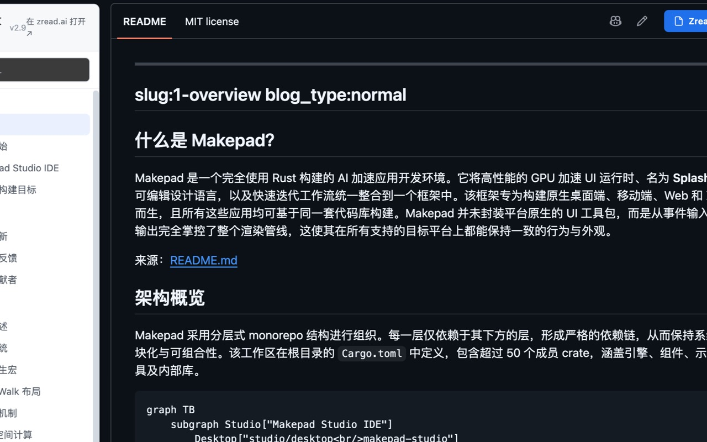

# Zread Docs for GitHub

在 GitHub 仓库页直接阅读 [zread.ai](https://zread.ai) 的 AI 文档 —— 左侧目录、点击切换、复用 README 区域显示。

Read [zread.ai](https://zread.ai) AI-generated documentation right on any GitHub repository page — sidebar table of contents, one-click switching, rendered inside the README area.



## 功能 / Features

- 📚 **文档目录侧栏**：仓库页左侧显示 zread 文档目录（可折叠 section/group），点击在 README 区域阅读。
  Documentation sidebar with collapsible TOC; click to read inside the README area.
- 🔁 **README 一键切换**：点击 GitHub 的 `README` 标签恢复原始 README。
  Click the native `README` tab to restore the original README.
- ⚡ **本地缓存 + 预取**：目录/文档本地缓存（≤50MB、LRU），并后台串行预取，二次打开秒开。
  Local cache (≤50MB, LRU) + background serial prefetch for instant re-open.
- 🤖 **自动收录/刷新**：未收录自动提交并显示排队 ETA；收录超过 7 天自动刷新；刷新中仍展示旧文档。
  Auto-submit unlisted repos (with queue ETA), auto-refresh after 7 days, and keep showing old docs while refreshing.
- 🧩 **代码块复制**：为渲染的代码块添加仿 GitHub 的复制按钮。
  Copy button on rendered code blocks, matching GitHub's style.
- 📊 **Mermaid 图表**：渲染 mermaid 流程图，支持全屏预览（放大/缩小/拖动/重置）。按需分包加载。
  Mermaid diagrams rendered with a fullscreen viewer (zoom/pan/reset); loaded on demand.
-  **暗色模式**：跟随系统 `prefers-color-scheme`。
  Follows system dark mode.
- 🌐 **国际化**：浏览器为中文时显示中文，否则英文（界面与文档内容均跟随）。
  English by default; Chinese when the browser language is Chinese (UI + content).

## 从源码构建 / Build from source

需要 Node.js ≥ 18。

```bash
npm install

# 开发（自动打开带扩展的 Chrome）
npm run dev

# 构建到 dist/chromium（含独立 mermaid 渲染器）
npm run build
```

构建产物在 `dist/chromium/`。

## 加载到 Chrome / Load unpacked

1. 打开 `chrome://extensions`，开启"开发者模式"。
2. 点击"加载已解压的扩展程序"，选择 `dist/chromium` 目录。
3. 打开任意 GitHub 仓库页（如 `https://github.com/owner/repo`，带/不带尾斜杠均可）。

## 打包上架 / Package for Chrome Web Store

```bash
npm run build
cd dist/chromium
zip -r ../release.zip . -x "_metadata*" -x "*.DS_Store"
```

注意：`manifest.json` 必须位于 ZIP 根目录，且不要包含 `_metadata`。
上传与权限说明见 Chrome Web Store 开发者控制台；本扩展使用的敏感权限（`cookies`/`scripting`/`tabs`/`declarativeNetRequest`/`storage`）均用于上述功能。

## 技术栈 / Stack

- [Extension.js](https://extension.js.org)（Manifest V3 + React + TypeScript）
- `marked` + `dompurify`（Markdown 渲染/净化）
- `mermaid`（图表，独立分包按需注入）

## 许可 / License

[MIT](LICENSE)
